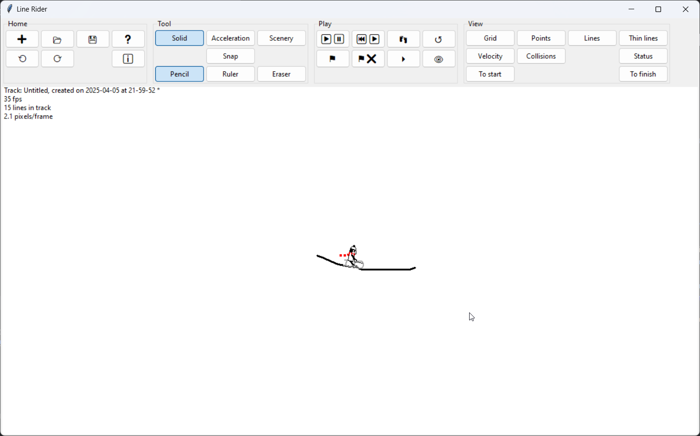

# Line Rider - Made possible with Python <3

## Get started
1. Have Python 3 installed
2. Clone the repository (packaging is to come soon)
3. Have fun!

## User interface

## Contributing
There is a LOT to be done! Feel free to join and have fun!
Only 2 rules:
- Bring some more fun
- Write clean code

## Credits for code history
This software is based on the code written by Massimo Burlando (alias massimo1220, https://github.com/massimo1220/lineRider-python3), \
who ported the code to Python 3 and improved it. Originally written by David Lu (Conundrumer, https://github.com/conundrumer).

This version aims at adding further functionalities to the game, made possible by first cleaning-up the code.
